# rorty_flutter

Rick and Morty

## Getting Started

This project is a starting point for a Flutter application.

A few resources to get you started if this is your first Flutter project:

- [Lab: Write your first Flutter app](https://docs.flutter.dev/get-started/codelab)
- [Cookbook: Useful Flutter samples](https://docs.flutter.dev/cookbook)

For help getting started with Flutter development, view the
[online documentation](https://docs.flutter.dev/), which offers tutorials, samples, guidance on
mobile development, and a full API reference.

#### Flutter App Screenshots

<table>
  <tr>
    <td>Splash</td>
    <td>Characters</td>
    <td>Character Detail</td>
    <td>Episodes</td>
    <td>Episode Detail</td>
    <td>Locations</td>
    <td>Location Detail</td>
    <td>Settings</td>
    <td>Abouts</td>
  </tr>
  <tr>
    <td></td>
    <td></td>
    <td>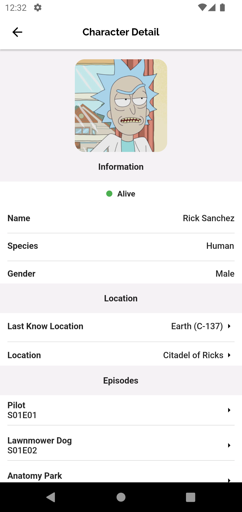</td>
    <td>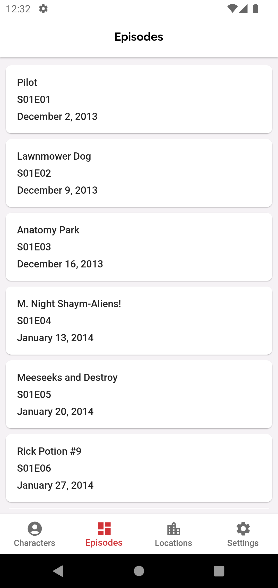</td>
    <td>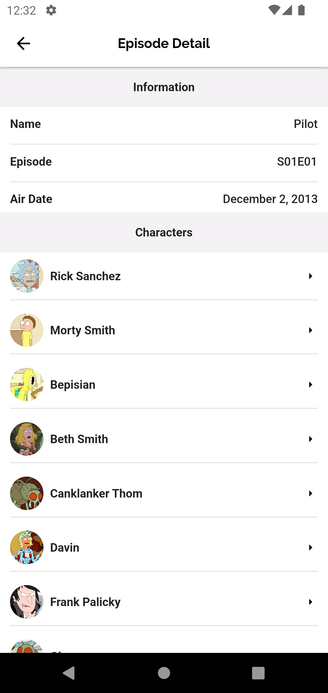</td>
    <td>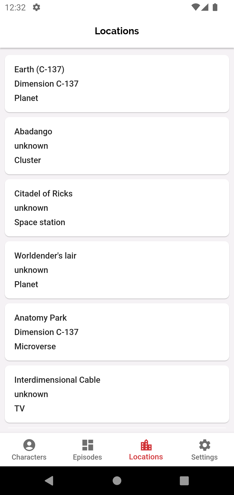</td>
    <td>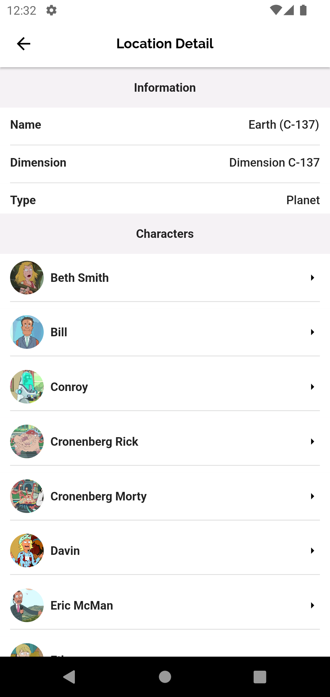</td>
    <td>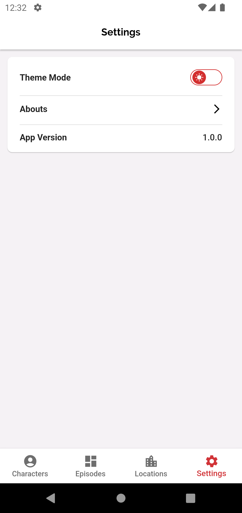</td>
    <td>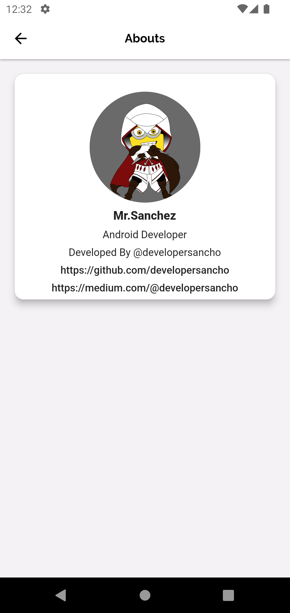</td>
  </tr>
 </table>

<table>
  <tr>
    <td>Splash</td>
    <td>Characters</td>
    <td>Character Detail</td>
    <td>Episodes</td>
    <td>Episode Detail</td>
    <td>Locations</td>
    <td>Location Detail</td>
    <td>Settings</td>
    <td>Abouts</td>
  </tr>
  <tr>
    <td></td>
    <td></td>
    <td>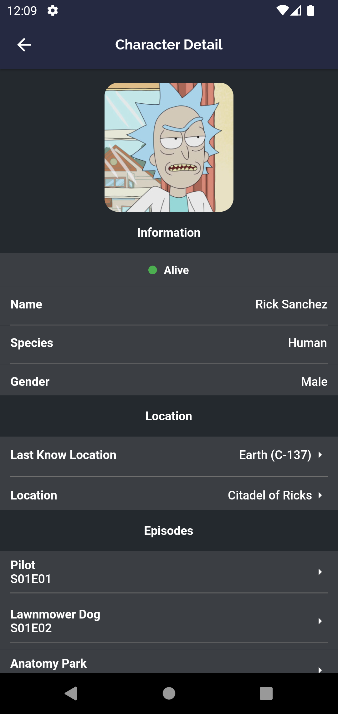</td>
    <td>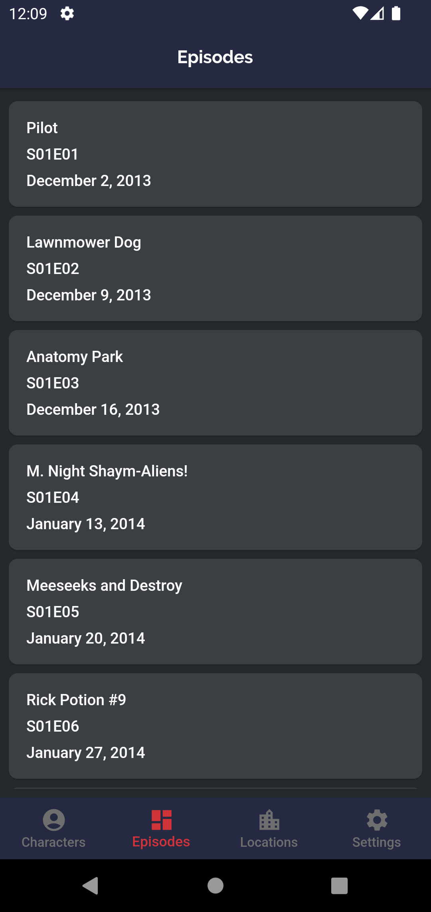</td>
    <td>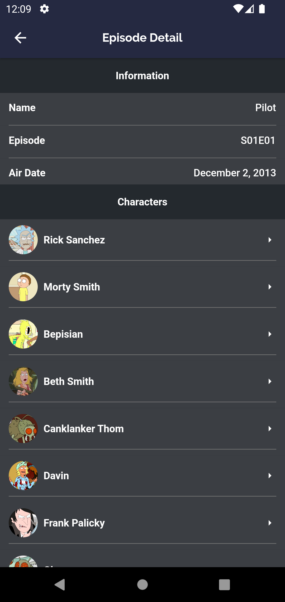</td>
    <td>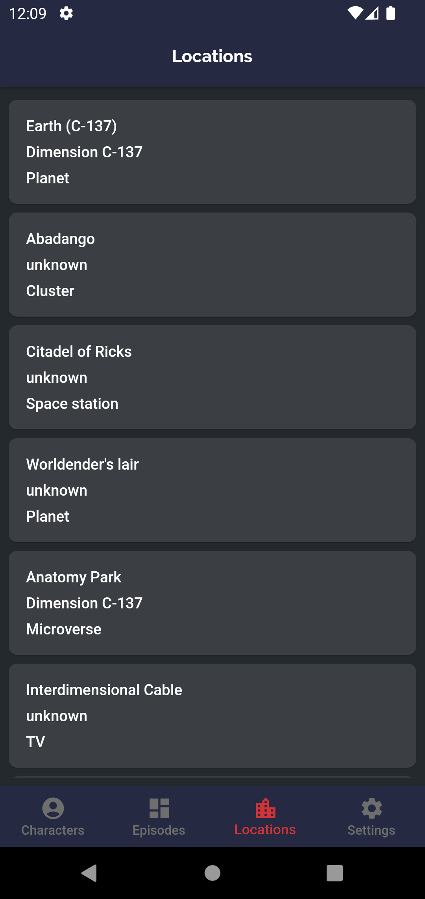</td>
    <td>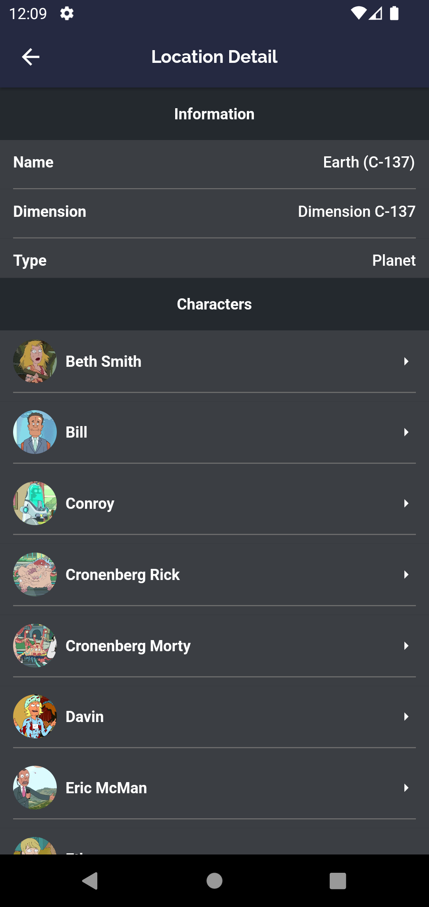</td>
    <td>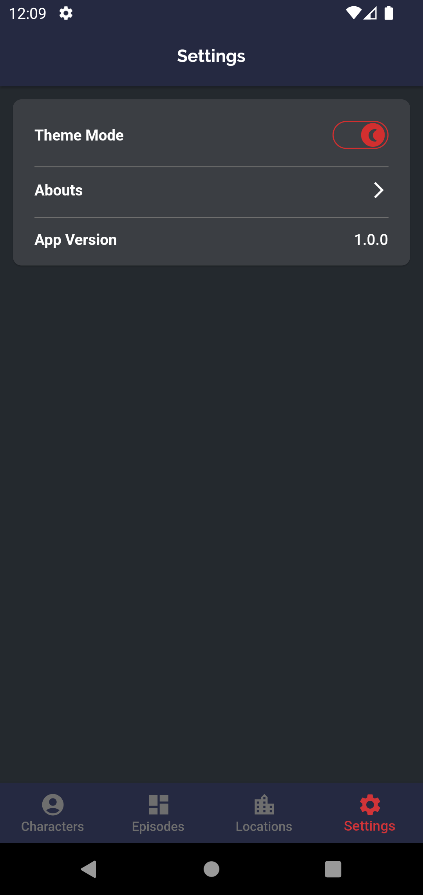</td>
    <td>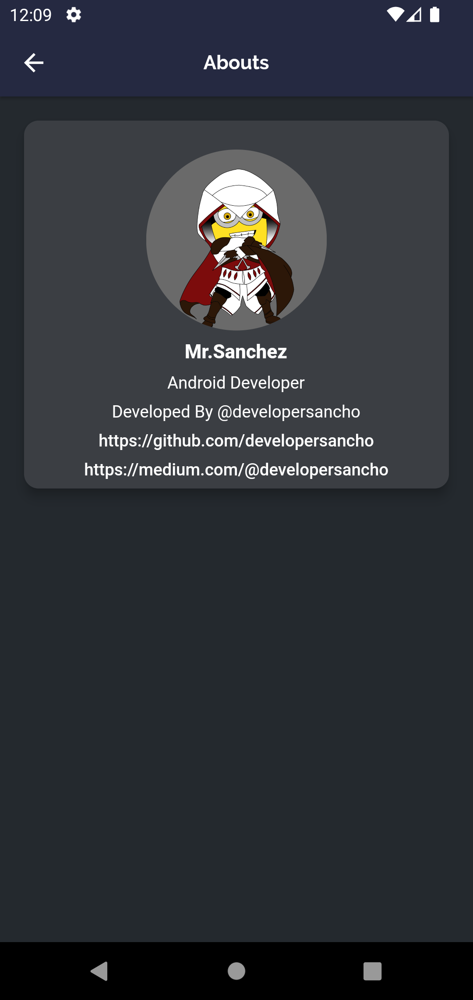</td>
  </tr>
 </table>
